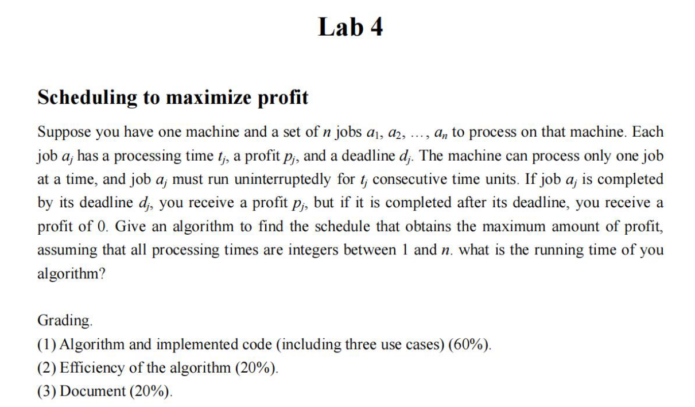

# Lab 4：基于动态规划的利润最优化问题

## 题目

## 分析思路

用动态规划。我最早的思路是【按照时间进行动态规划】。因为题目告知了时间都是离散的整数，那么，我一开始认为，可以遍历时间$t\in \{0,1...N\}$进行动态规划，对每个时间$i$，比较所有小于时间$i$的最优子方案$j$，将它们贪心地加上一个满足时间约束+ddl约束的任务之后的收益最大。但是，这个贪心思路是错误的。

经过思考后，我认为不应该用离散时间刻进行dp，而应该用ddl升序的任务序列进行dp。思路如下：

1. 对所有任务按照ddl升序排列；
2. 这样，问题就转化成了【如果只考虑前n个任务，如何使总收益最大】。在n-1已经最优的前提下，这会有两种情况：

    - 不做第n个任务，即直接转移dp[n-1];
    - 做第n个任务。但是，dp[n-1]的任务序列不一定保证加上第n个任务是可行的。这意味着我们需要找到第n个任务的前驱，也就是，ddl在任务n的开始时间之前的最晚的那个任务j。

3. 所以需要维护一个前驱数组，记录每个任务的对应前驱。这本质上是一个在已经排好序的ddl数组中二分查找开始时间s的最优下界问题。可以二分查找。

4. 根据下面的状态转移方程进行动态规划即可：

$$ dp(i) = \text{max}(dp(i-1), dp(pred(i)) + profit(i)) $$

这个算法是正确的。

## 复杂度分析

- **排序步骤**：复杂度为$O(n\log{n})$
- **求解前驱步骤**：二分查找，复杂度为$O(\log{n})$
- **动态规划步骤**：复杂度为$O(n)$

三者求和，算法的整体复杂度就是$O(n\log{n})$。

## 测试用例

| 任务编号 | t（耗时） | d（截止时间） | p（利润） |
|---------|-----------|----------------|------------|
| 1       | 2         | 3              | 40         |
| 2       | 1         | 1              | 20         |
| 3       | 2         | 5              | 60         |
| 4       | 1         | 2              | 30         |

**预期输出：**

最大利润：`110`

| 任务编号 | t（耗时） | d（截止时间） | p（利润） |
|---------|-----------|----------------|------------|
| 1       | 3         | 4              | 50         |
| 2       | 1         | 2              | 30         |
| 3       | 1         | 3              | 25         |
| 4       | 2         | 3              | 40         |

**预期输出：**

最大利润：`70`

| 任务编号 | t（耗时） | d（截止时间） | p（利润） |
|---------|-----------|----------------|------------|
| 1       | 3         | 100            | 100        |
| 2       | 1         | 2              | 60         |
| 3       | 1         | 2              | 60         |
| 4       | 2         | 3              | 90         |

**预期输出：**

最大利润：`210`

