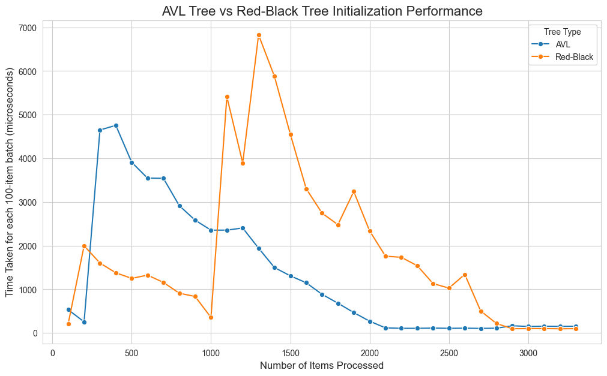
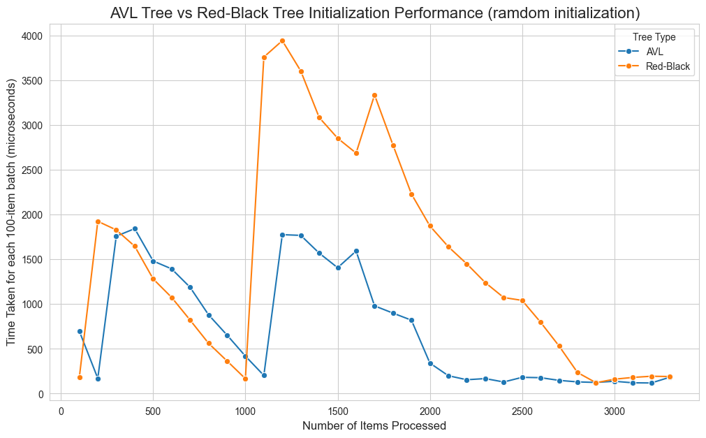
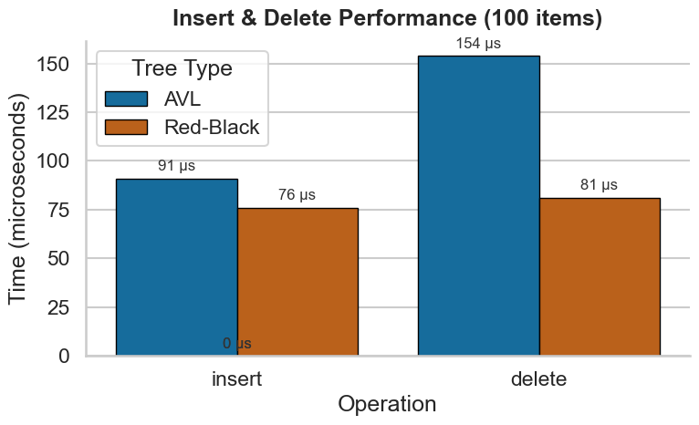
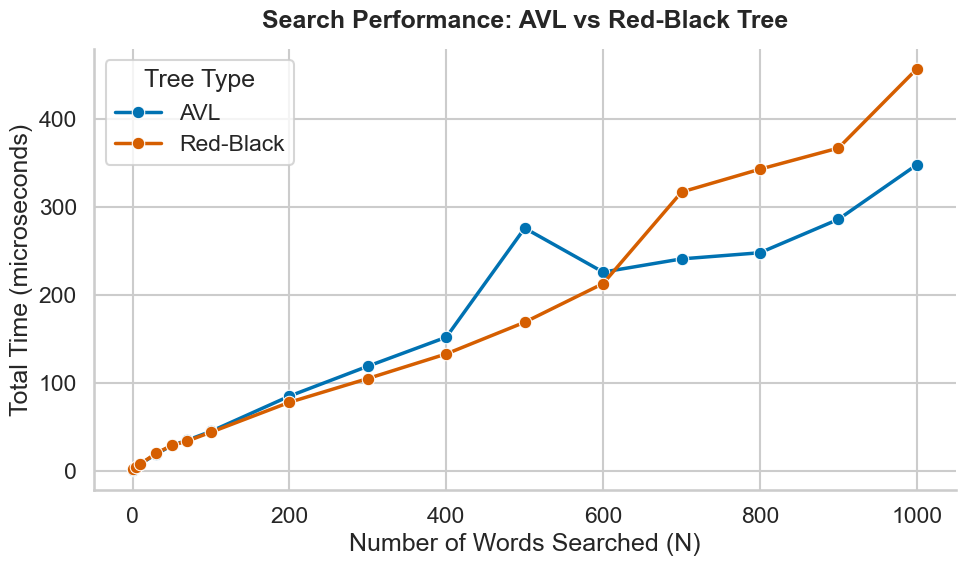

# 数据结构PJ2：基于二叉搜索树的汉英词典

## 问题分析：

本次pj要求通过二叉搜索树（包括AVL树和红黑树）实现高效的中英词典，并进行性能测试。

AVL树要求树的不同叶子节点之间高度差不超过1，从而保证了高效的查询效率；但是在插入和删除时，则涉及到回溯式的旋转操作，效率不如红黑树高。

红黑树则通过一系列复杂的颜色规则、旋转和染色操作来保证树结构的基本平衡和插入删除时的最小影响。这意味着，红黑树长于插入和删除操作，效率很高。但在查询功能上可能是AVL树更优，因为在极端情况下，红黑树会导致最深的叶子节点的高度是最浅的叶子节点的两倍，这意味着某些情形下，红黑树的查询不如AVL树稳定。尽管从复杂度分析的角度来说，二者的复杂度都是$O(n\log{n})$ 。

而对于词典这种需求，**对查询的要求是高于对插入、删除的要求的**。词典的常态化使用场景都是查询，初始化、插入和删除往往是在需要更新时才需要用到，并不是一个常态化的需求。这意味着，从理论分析的角度来看，可能是AVL树对词典更优。这也需要实验证据的证明。

根据分析，在实验开始之前，我们假设：

1. 在初始化、插入和删除上，红黑树比AVL树快；
2. 在查询上，AVL树比红黑树快。

对每棵树都需要实现以下的功能：

- `insert`：插入；
- `delete`：删除；
- `search`：查找；
- `preorder_print`：前序打印出树的结构；

特别地，pj要求了一些批次（batch）操作的功能，它们可以通过针对单个单词的功能复用写出来。包括：

- 范围查询：查找`a`到`bc`区间内的所有词；
- 范围插入/删除：插入/删除一整个文件里的词表；

具体的代码实现，没有什么特别之处，把书上的伪代码翻译成c++即可。需要注意红黑树存在一大堆莫名其妙的边界条件和复杂的颜色规则维护操作。

项目包含了五个代码文件。

- `avl_tree.h`：提供了AVL树的类和对应功能
- `rb_tree.h`：提供了红黑树的类和对应功能
- `dictionary.cpp`：提供了字典的“操作界面”，可以查词玩
- `analysis.cpp`：进行各个功能的性能测试，写入csv
- `plot.ipynb`：画图用

## 性能分析

### 初始化的性能分析

下图展示了在插入原始的`init.txt`的数据集时，AVL树和红黑树，每插入一百个词耗费的时间差距。如图所示：

这是一个非常有趣而且难以理解的开销模式。主要包括以下几点。第一，我们一般觉得红黑树会更快，但是这个结果告诉我们，在1000数据量以下红黑树才有优势，在1000以上反而变成了AVL树更快。第二，批次处理时间的变化随处理数据数量的变化模式非常奇怪。我们可以观察到，对于AVL树，在300左右，处理时间出现了一个山峰，在那之后缓缓下降；而对于红黑树，在200处、1000处这两个位置，则出现了两个山峰，并且经历了相似的下降过程。对于这个开销变化模式，我称为“**多峰陡增缓降模式**”。第三，在数据量较小时，二者的插入开销都非常大，达到上千ms的量级；但是当数据量较大（对AVL树，大于2000；对于红黑树，大于2800）时，开销已经趋近于零。

为什么会这样？我首先猜测，会不会有`init.txt`中的数据都已经排好序了的原因？所以我对`init.txt`中的数据进行了随机打乱，然后进行测试。结果如下：

不难发现，前面发现的**多峰陡增缓降**模式，在打乱数据中也是存在的。比较有趣的区别在于，对于打乱数据，AVL树和红黑树的变化模式变得更加相近，它们的波峰出现的位置更加接近。**但是，我们还是观察到了红黑树不如AVL树的奇怪现象**。

这些现象是本报告的核心研究问题。如何理解**多峰陡增缓降模式**的成因？如何理解**插入已排序数据**对AVL树和对红黑树的不同影响？

### 插入时间开销模式的实验

首先，我们有必要确认，**这种开销模式是机器有关的，还是机器无关的**。换言之，是因为缓存、内存分配之类的原因导致了它的出现，还是因为树算法的特点导致了它的出现。为此，我让ChatGPT帮我做了一个小实验。思想是，既然直接记录时间，会把机器优化问题也计算进去，那我们只计算“抽象操作时间”的话就可以排除机器影响了。下表展示了排除机器因素后，AVL树和红黑树在处理有序数据和无序数据插入时，其单位开销随已有节点数的变化情况。所有的走树时访问结点、比较 key、重新计算高度、检查平衡因子（AVL）、旋转（AVL / RB）、recolor（红黑树），都会被赋予一个“抽象理论耗时”。这样，就可以排除机器因素的影响。（注：这部分因为不是核心实验，代码没有包括在提交文件里）

.png>)

从图中可以观察到，对于AVL树，插入数据的有序与否对性能的影响不大；但是对于红黑树来说，插入数据的有序与否对性能是有显著影响的（常数因子量级）。不过有两点非常明确，第一，前面的**多峰陡增缓降模式**并没有被观察到，这意味着它们是机器优化的产物，而不是纯粹算法的产物；第二，**在理论开销计算中，红黑树在任何数量级中，都优于AVL树**，这也和前面的计算相反。最后，四条曲线都和理论时间复杂度分析的O(logn)量级相吻合，它们之间只有常数因子的差异。

既然已经证明了前面的奇怪模式是机器原因而不是算法原因导致的，这就不是这门课的重点了。但还是可以做一些猜想。我认为有下面的一些原因：

1. 内存分配的摊销问题。C++的 new 操作符并非恒定时间开销。当程序初始化或连续插入大量节点时，内存分配器预先申请的堆空间会被耗尽。此时，分配器必须发起昂贵的系统调用向操作系统申请新的内存页。图中那些剧烈的尖峰，很可能对应了内存分配器耗尽当前内存池、强制进行扩容的时间点。

为何红黑树的波动更剧烈？ 可能是因为红黑树的节点结构通常比AVL树更复杂。AVL节点仅需两个子节点指针、一个整数（高度）和数据；而红黑树节点除了两个子节点指针、数据外，还必须存储父节点指针以及颜色位。这意味着红黑树节点的sizeof更大，消耗内存的速度更快，从而更频繁地触发分配器的扩容操作，导致了更多的尖峰。

2. 缓存局部性问题。随着内存扩容完成，分配器进入了“快路径”分配模式（即在新申请的大块连续内存上简单移动指针），因此分配开销降低。更重要的是，对于词典这种宏观上有序（即便局部打乱，整体依然遵循字典序）的数据，具有较好的缓存局部性：连续分配的节点在物理内存上是相邻的。当插入具有相似前缀的单词时，访问路径上的节点很可能已经被加载到CPU的L1/L2缓存中，极大地降低了访存延迟。

3. 分支预测问题。即使数据被打乱，但由于词典数据的分布特性，插入路径往往存在某种倾向性（例如，处理'c'开头的单词时，路径总是偏向树的某个分支）。现代CPU的分支预测器能够“学习”这种模式。这解释了为什么在波峰之后，平均耗时会由高向低滑落，甚至在数据量很大时出现接近0的极低耗时。

4. 节点内存占用问题。在纯算法层面（抽象操作实验），红黑树确实因旋转少而占优。但在真实机器上：AVL树节点小，内存占用少，缓存利用率高。红黑树节点大（多一个指针），且为了维护红黑性质，**虽然旋转少了，但需要频繁访问和修改父节点、叔叔节点的颜色**。这些操作导致了更多的指针跳转和内存写入。 在现代计算机架构下，**内存延迟（Memory Latency）**往往是性能瓶颈。AVL树虽然旋转多（计算密集），但其更紧凑的内存布局和更少的指针解引用操作（访存密集），反而使其在实际运行时间上击败了理论更优的红黑树。

### 插入、删除和查询的性能分析

这部分没有什么好说的。下表展示了插入和删除的开销比较：

可见，对于插入和删除，即使是在机器环境下，也是红黑树优于AVL树。对于删除，红黑树的优势比AVL树更大一些。这一点很好理解。每一次插入，最多产生AVL树的两次旋转操作；但是对于删除，可能导致失衡的向上传播，从而使得AVL树产生大量的旋转操作。而红黑树能够较好地解决这个问题，无论怎么删，最多只需要 3 次旋转就能恢复平衡。其他的调整全部是通过变色完成的，而变色是可以瞬间完成且不改变拓扑结构的。

下图展示了不同的查询数量的AVL树和红黑树的性能差异：

可见，在机器环境下，在单词数小于600时，红黑树略微占优（但不强）；而当搜索的词数大于600时，AVL树反而占优。这主要是因为AVL树更加平衡的原因。

## 总结

实验表明，尽管红黑树理论上插入删除更优，但在真实机器环境下，受内存分配和缓存影响，AVL树在初始化时反而更快。对于词典应用，AVL树在大量查询场景下表现更佳，且其严格平衡带来的查询优势足以抵消维护成本。因此，AVL树更适合构建静态或半静态的高效词典。